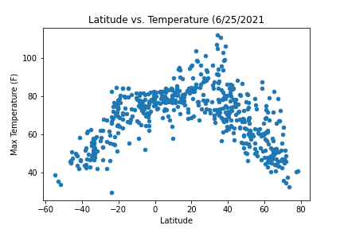
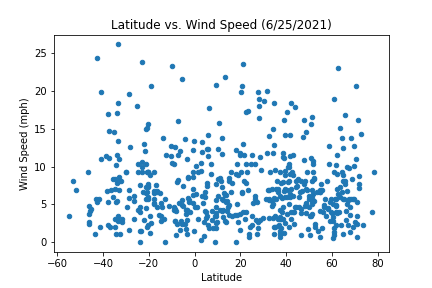

# python-api-challenge

There was no city with humidity over 100!

Steps VacationPy: 

1. Import all dependencies
2. Create/get api key and place in api_keys.py file and import g_key
3. Load cities.csv
4. Configure maps using Latitude and Longitude as locations and humidity as weight
5. Add heatmap
6. Create new dataframe for cities that have ideal weather conditions 
7. Create a new dataframe for hotels. Add a Hotel Name column to DF
8. Create lat variable using hotel_df and groupby city and Latitude
9. Store the first hotels that pop up in DF and use them as markers for the gmap
10. Create gmap wioth previous dfs and variables

Steps WeatherPy:

1. Import dependencies 
2. Set lat and lng range
3. Make empty list for lat and lng to hold cities
4. Create code to find cities (amount will vary) that are close to the specified lat and lng in Step 2
5. use openweathermap api and find weather data for the cities that appear in Step 4 and store it 
6. Create a new DF for the weather stats for the cities and turn it into a CSV (RetrievedData.csv)
7. Create variables for checking lat vs (wind, humidity, cloud, temp) using the city stat 
8. Do a count of the city_stat_pd
9. Get mean, median, standard dev, min, max and quartile of city_stat_pd using describe function
10. Plot for lat vs (wind, humidity, cloud, temp)
11. Perform linear regression on the various graphs

Obervation 1: With Lat vs Temperature, we can see that as the latitude increases beyond 20 or decreases belowe -20 then the temperature will also decrease. It also makes sense to note that the highest temperature lies around the equator.

 

 

 

Observation 2: Although cloudiness is very random/scattered, we can see that in the northern hemisphere there is a higher percentage of clouds ranging 50% and above noting that there are more instances of cloudiness at 100% within the northern hemishpere than the south.

 

 

 

Observation 3: From the linear regression data for windspeed, the windspeed gradually increases the further north we go within the northern hemisphere whereas for the southern hemisphere the further north or closer to the equator we go, the wind decreases. But the wind speed increase/decrease is minimal. 

 

 

 
