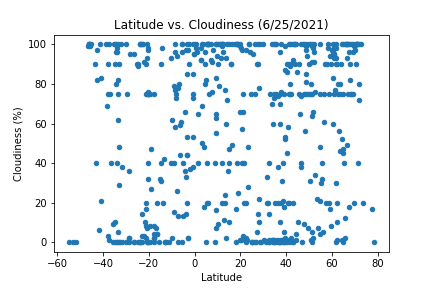

# python-api-challenge

There was no city with humidity over 100!

Description: This is made to utilize a weather_api and google_api to create data sets about weather and hotel locations.

Obervation 1: With Lat vs Temperature, we can see that as the latitude increases beyond 20 or decreases belowe -20 then the temperature will also decrease. It also makes sense to note that the highest temperature lies around the equator.

 

 

 

Observation 2: Although cloudiness is very random/scattered, we can see that in the northern hemisphere there is a higher percentage of clouds ranging 50% and above noting that there are more instances of cloudiness at 100% within the northern hemishpere than the south.

 

 

 

Observation 3: From the linear regression data for windspeed, the windspeed gradually increases the further north we go within the northern hemisphere whereas for the southern hemisphere the further north or closer to the equator we go, the wind decreases. But the wind speed increase/decrease is minimal. 

 

 

 
